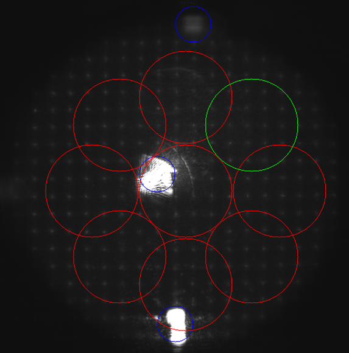

<p align="center">
  <!-- Project Badge -->
  <a href="https://github.com/artuppp/Best-Blob-Finder-in-Cplusplus.-Even-better-than-OpenCV"></a>
  <!-- Code Repository Badge -->
  <a href="https://github.com/artuppp/Best-Blob-Finder-in-Cplusplus.-Even-better-than-OpenCV"></a>
  <!-- License Badge - Replace with your actual license -->
  <a href="#license"></a>
  <!-- Last Commit Badge -->
  <a href="https://github.com/artuppp/Best-Blob-Finder-in-Cplusplus.-Even-better-than-OpenCV/commits/main"></a>
  <br>
  <!-- Stars Badge -->
  <a href="https://github.com/artuppp/Best-Blob-Finder-in-Cplusplus.-Even-better-than-OpenCV/stargazers"></a>
  <!-- Forks Badge -->
  <a href="https://github.com/artuppp/Best-Blob-Finder-in-Cplusplus.-Even-better-than-OpenCV/network/members"></a>
  <!-- Watchers Badge -->
  <a href="https://github.com/artuppp/Best-Blob-Finder-in-Cplusplus.-Even-better-than-OpenCV/watchers"></a>
  <!-- Open Issues Badge -->
  <a href="https://github.com/artuppp/Best-Blob-Finder-in-Cplusplus.-Even-better-than-OpenCV/issues"></a>
</p>

<p align="center">
  <!-- TODO: Add a cool GIF or screenshot of BlobFinder in action! -->
  <!-- Example:  -->
  <!-- O puedes usar una imagen estática subida a GitHub Issues como te expliqué: -->
  <!--  -->
  
</p>

<h1 align="center">BlobFinder</h1>

<p align="center">
  <i>An efficient C++ implementation for blob detection using the Laplacian of Gaussian (LoG) method, inspired by scikit-image's robust functionality.</i>
</p>
<hr>

## 🌟 Introduction

Welcome to **BlobFinder**! This project provides a C++ library for detecting blobs (regions of interest) in images using the Laplacian of Gaussian (LoG) algorithm. It's designed to be efficient and flexible, allowing for parameter tuning to suit various image analysis tasks. The implementation draws inspiration from the well-regarded `blob_log` function in the scikit-image Python library.

This tool is particularly useful for identifying features of a certain scale within an image, such as spots, cells, or other distinct patterns.

## ✨ Features

*   🎯 **Laplacian of Gaussian (LoG):** Employs the LoG method for robust blob detection across different scales.
*   ⚙️ **Configurable Parameters:** Allows fine-tuning of `min_sigma`, `max_sigma`, `num_sigma`, and `threshold` for precise detection.
*   🖼️ **Downscaling Support:** Includes an example demonstrating how to effectively use image downscaling before detection and then rescale results, optimizing performance for large images.
*   🚀 **C++ Implementation:** Written in C++ for performance, leveraging OpenCV for image manipulation.
*   💡 **Border Exclusion:** Option to exclude blobs that touch the image border.
*   📚 **Inspired by scikit-image:** Aims to provide similar functionality to `skimage.feature.blob_log` for C++ developers.

## 🚀 Quick Example: Downscaling & Detection

Here's an example of how to use `BlobFinder` with image downscaling and subsequent re-scaling of the detected blob coordinates:

```cpp
// Constructor
// BlobFinder(float default_min_sigma, float default_max_sigma, int default_num_sigma);
// These defaults can be overridden in the blob_log call.
blobFinder = BlobFinder(5, 20, 4); // Example default sigmas

// --- Image Preparation ---
cv::Mat imageRawWB; // Your input image (e.g., cv::imread("path/to/image.png", cv::IMREAD_GRAYSCALE))
// ... load or acquire imageRawWB ...

cv::Mat imageRawWB2;
// Downscale the image (e.g., by a factor of 4)
cv::resize(imageRawWB, imageRawWB2, cv::Size(), 0.25, 0.25, cv::INTER_AREA);

// --- Blob Detection ---
// Parameters for blob_log:
// cv::Mat image: The input image (grayscale recommended).
// float min_sigma: The minimum standard deviation for the Gaussian kernel.
// float max_sigma: The maximum standard deviation for the Gaussian kernel.
// int num_sigma: The number of intermediate scales to scan.
// float threshold: The absolute lower bound for scale-space maxima.
// bool exclude_border: If true, exclude blobs touching the border.
auto reflexes = blobFinder.blob_log(imageRawWB2, 5, 20, 4, 0.1, false);
// Logger::Log("WavefrontAnalyzer::processHS", "end blob finder"); // Optional logging

// --- Re-scale Reflexes to Original Image Size ---
// If you downscaled by a factor (e.g., 4), you need to upscale the coordinates and radius.
const float upscale_factor = 4.0;
std::transform(reflexes.begin(), reflexes.end(), reflexes.begin(), 
    [upscale_factor](std::tuple<int, int, float>& x) {
        std::get<0>(x) = static_cast<int>(std::get<0>(x) * upscale_factor); // x-coordinate
        std::get<1>(x) = static_cast<int>(std::get<1>(x) * upscale_factor); // y-coordinate
        std::get<2>(x) = std::get<2>(x) * upscale_factor;                   // radius (sigma)
        return x;
    });

// Now 'reflexes' contains tuples of (x_original, y_original, radius_original)
// for each detected blob in the original image's coordinate system.
